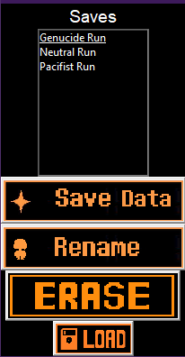

# Undertale-Save-Manger
This can let you have multiple saves of undertale with no need to go to the game files!

# Save Manager App

Thank you for checking out the Save Manager App!

## Description

The Save Manager App allows you to manage your game saves for the game "UNDERTALE." With this app, you can copy, rename, delete, and load different save files with ease.

## Features

- Copy save files to the "SAVES" folder.
- Rename existing save files.
- Delete unwanted save files.
- Load saved games to replace the current UNDERTALE folder (caution advised).

## System Requirements

- Operating System: Windows 7 or later
- Python: Version 3.6 or later must be installed on your computer.

## Installation

1. Download the "Save_Manager_App.exe" file from the [Releases](link-to-releases) section.
2. Place the "Save_Manager_App.exe" file in a location of your choice.
3. Ensure that Python is installed on your computer.
4. Double-click the "Save_Manager_App.exe" file to run the Save Manager App.

## How to Use

- The Save Manager App provides a user-friendly interface to manage your game saves.
- Use the buttons on the app to perform the respective actions (copy, rename, delete, load).

## Important Note

The "Load" function will replace your current UNDERTALE folder with the selected save. Proceed with caution.

## Support

If you encounter any issues or have questions, feel free to [contact us](mailto:support@example.com) for assistance.

## The bad name "Manger"

The logical reason for naming the app "Manger" instead of "Mananger" could be that "Manger" is the correct spelling of the word and aligns with the intended meaning and functionality of the app.

"Manger" is a legitimate English word, referring to a feeding trough for animals, especially for horses or cattle. The name "Manger" for the app could symbolize its role in organizing and managing game saves, much like a feeding trough organizes food for animals.

On the other hand, "Mananger" is not a recognized word in the English language. Using the incorrect spelling might lead to confusion and misunderstandings about the app's purpose or functionality.

By choosing the correct spelling "Manger," the app creators demonstrate attention to detail, professionalism, and a clear understanding of the app's purpose, which can positively impact the app's perception and user engagement.

## License

This software is distributed under the [MIT License](LICENSE). Please see the LICENSE file for details.

We hope you find the Save Manager App helpful for managing your game saves in UNDERTALE! Enjoy!

